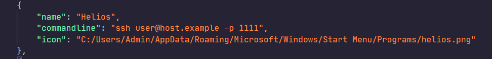
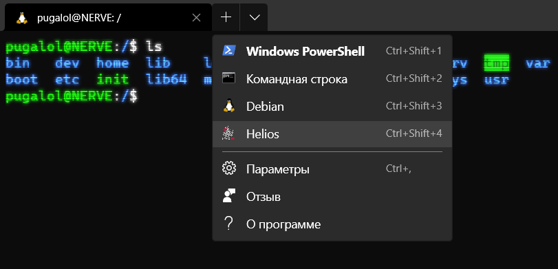
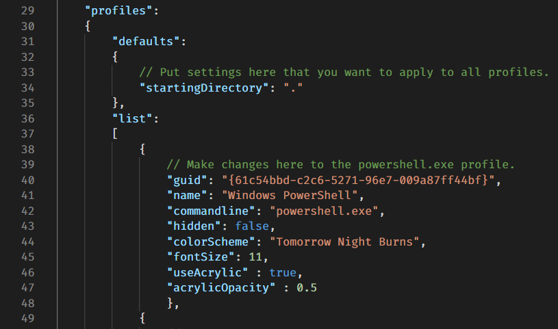

# Setup ssh-profile

## 0. Preparing

Launch Windows Terminal, call the drop-down menu, and open the settings file. 

## 1. Creating profile

Create new profile with name, which your wanted and ssh profile in ```commandline``` attribute.


## 2. Adding an icon

Put image in some folder and add attribute ```icon``` to profile.



Result:



# Adding "Open Windows Terminal here" in context menu

## 0. Preparing

Clone the repository in any directory in your file system.

## 1. Setting the current directory as the default directory

Launch Windows Terminal, call the drop-down menu, and open the settings file. Add a key to the default profile settings: ```"startingDirectory": "."``` .


This will tell the terminal to open in the current directory, not the home one.

## 2. Adding an item to the context menu

Run `` script.bat`` as administrator. In the end you get:
