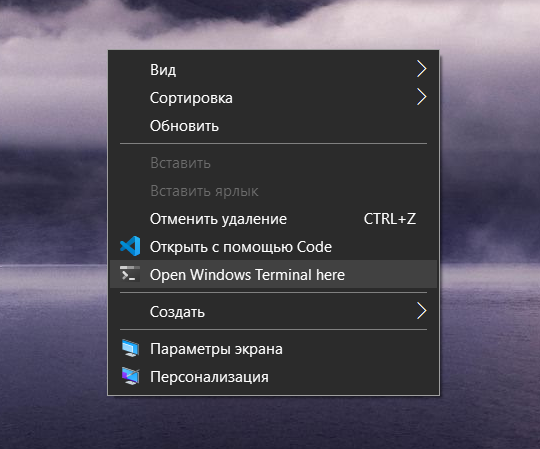

# Adding "Open Windows Terminal here" in context menu

## 0. Preparing

Clone the repository in any directory in your file system.

## 1. Setting the current directory as the default directory

Launch Windows Terminal, call the drop-down menu, and open the settings file. Add a key to the default profile settings: ```"startingDirectory": "."``` .


This will tell the terminal to open in the current directory, not the home one.

## 2. Adding an item to the context menu

Run `` script.bat`` as administrator. In the end you get:
