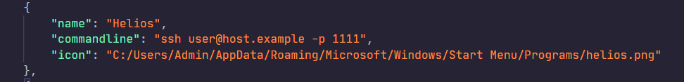
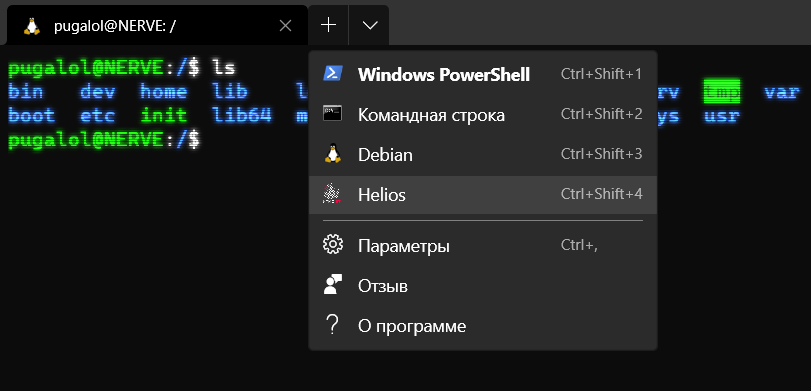
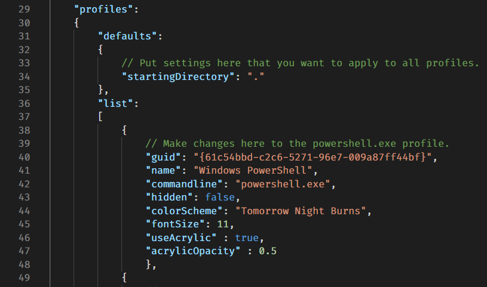
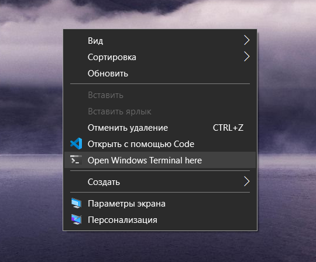
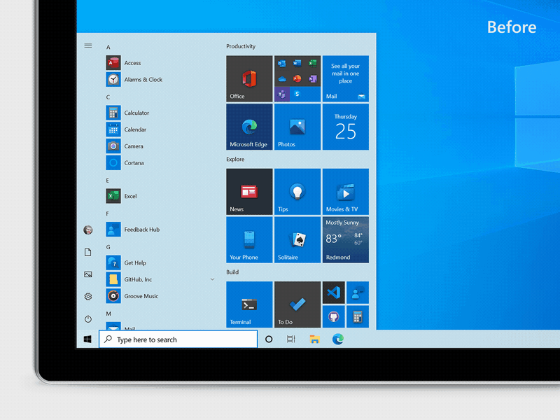

# Setup ssh-profile

## 0. Preparing

Launch Windows Terminal, call the drop-down menu, and open the settings file. 

## 1. Creating profile

Create new profile with name, which your wanted and ssh profile in ```commandline``` attribute.


## 2. Adding an icon

Put image in some folder and add attribute ```icon``` to profile.



Result:



# Adding "Open Windows Terminal here" in context menu

## 0. Preparing

Clone the repository in any directory in your file system.

## 1. Setting the current directory as the default directory

Launch Windows Terminal, call the drop-down menu, and open the settings file. Add a key to the default profile settings: ```"startingDirectory": "."``` .


This will tell the terminal to open in the current directory, not the home one.

## 2. Adding an item to the context menu

Run `` script.bat`` as administrator. In the end you get:


# Activating the new start menu in Windows 10 (not actual on Windows 10 2010)



## 0. Preparing

Go to `Settings -> System -> About` and check that you have version `19041.423` or above. If it's true, you can activate new menu.

## 1. Apply

Run [script](new_win10_start_menu/win10_new_start_menu.ps1) with param `--on`.

## 2. Undo

Run [script](new_win10_start_menu/win10_new_start_menu.ps1) with param `--off`.

# Team Viewer patcher

After execution this scripts, Team Viewer private usage warning window will no longer appear.

# Copy all

Copy all data from with metainfo exclude `pattern` arg paths. Required installed [sudo](https://github.com/gerardog/gsudo) for Windows.

# Normalize dates

This script was used to edit the file metadata: the file creation date was set equal to the modification date after copying without saving all the metadata.

# PDFMerger

Merges several pictures or pdfs into one pdf.

# afterburner_startup

Startup MSI Afterburner only if discrete GPU enabled in Device Manager

# docker_env

Script for download and restore utilized containers on new PC. Also works on Unix machines with installed PowerShell 7.

# postinstall

Scripts for restore system envs on clean Mac.
